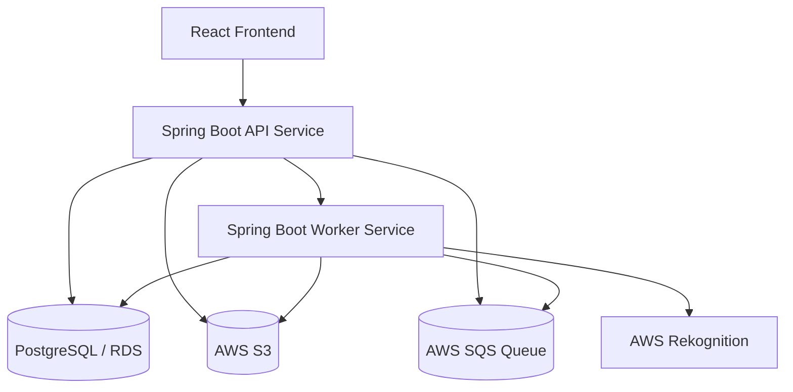

# Requirements

### Overview & Goals
Capture an implementation-ready blueprint for the first production foundation of the event photo discovery platform (to execute in a future session), where guests find their photos via `QR + selfie` and the backend runs as two logical services: `API` and `Worker` from one codebase.

### Scope
#### In Scope
- Multi-module project setup across:
  - `momento-ui` (React + Vite + Tailwind + Nginx)
  - `momento-service` (Spring Boot API)
  - `momento-worker` (Spring Boot worker runtime from same backend codebase/profile)
- Core user roles and flows:
  - Organizer/admin: create events, generate QR codes, manage retention/deletion.
  - Photographer: upload event photos and view processing status.
  - Guest: scan QR, consent, upload selfie, receive matched photos, download photos.
- Backend infrastructure integration:
  - PostgreSQL + Flyway schema migrations
  - S3 storage for original photos and thumbnails
  - SQS-based async processing
  - AWS Rekognition indexing/matching
- Security baseline: Spring Security + JWT for authenticated roles.

#### Out of Scope (initial milestone)
- Advanced commercial features (subscriptions, agency billing, enterprise packaging).
- CDN optimization (CloudFront) beyond architecture-ready integration points.
- Native mobile apps.

### Functional Requirements
- Admin can create an event; backend persists it in PostgreSQL, creates an event-scoped Rekognition collection (e.g., `event_{id}_collection`), stores the collection reference, and returns a QR URL targeting the public guest route (`/e/{slug}`).
- Organizer setup includes an explicit organizer responsibility agreement confirming lawful photo collection/processing obligations before an event can be activated.
- Public guest flow must present privacy policy text and require a consent checkbox before selfie upload is allowed.
- Photographer can authenticate, open assigned events, request S3 pre-signed upload URLs, upload photos directly from browser to S3, and confirm upload so photo records are created and queued for processing.
- Worker consumes queued photo jobs, executes Rekognition `IndexFaces`, stores face metadata and returned `FaceId` values, generates thumbnails, and transitions photo status through `UPLOADED -> QUEUED -> PROCESSING -> PROCESSED` (or `FAILED`).
- Guest can open public event page by QR slug, accept consent, upload/take a selfie, trigger Rekognition `SearchFacesByImage`, and receive matching photo thumbnails with temporary download URLs.
- Backend stores selfies only in temporary S3 paths and deletes each selfie immediately after search completion (with cleanup fallback for failures).
- Event retention is configurable per event with platform defaults of `30/60/90` days; expiry removes event photos, thumbnails, related metadata, and the associated Rekognition collection.
- Originals remain private in S3; guest access is only via short-lived pre-signed download URLs.
- The platform persists core entities in dedicated tables: `users`, `events`, `event_photographers`, `photos`, `rekognition_collections`, `rekognition_faces`, `guest_searches`, `downloads`, and consent/agreement tracking records.
- Admin can assign/remove photographers and trigger operational actions such as event reprocessing and expiration workflows.

### Non-Functional Requirements
- Privacy-by-default for biometric workflows (explicit consent gate, minimal selfie retention, and auditable deletion path).
- Asynchronous processing for scalability and resilience.
- Clear separation of API concerns vs background job concerns while reusing one backend codebase.
- Idempotent worker processing and retry-safe job handling.
- Private bucket/object ACL strategy with no direct public object exposure.

# Technical Design

### Current Implementation
Repository investigation shows a skeleton workspace with only:
- `README.md`
- `momento-service/README.md`
- `momento-ui/README.md`
- `momento-worker/README.md`

No existing source code or established internal patterns are present yet, so the implementation plan focuses on creating a consistent baseline architecture aligned with the requested stack and service split.

### Key Decisions
1. **Single backend codebase, dual runtime profiles**
   - Keep one Spring Boot backend project as source of truth, deployed as two logical services (`api` profile and `worker` profile).
   - Rationale: shared domain/model consistency with operational separation.

2. **Hybrid processing model**
   - API handles synchronous user-facing operations; worker handles long-running photo processing jobs via SQS.
   - Rationale: responsive guest/photographer UX and scalable background throughput.

3. **Storage and matching pipeline on AWS primitives**
   - S3 for binaries, Rekognition for face detection/index/match, SQS for decoupled job execution.
   - Rationale: managed services optimized for media and face workflows.

4. **Privacy-first retention and access controls**
   - Enforce explicit guest consent, immediate selfie deletion after search, event retention windows, and private-by-default S3 access with pre-signed URLs.
   - Rationale: biometric data handling requires least-retention and strict access boundaries.

### Proposed Changes
- **`momento-service` (API runtime):**
  - Implement service layer split requested by product flow: `AuthService`, `UserService`, `EventService`, `PhotoService`, `UploadService`, `S3Service`, `RekognitionService`, `ProcessingQueueService`, `QrCodeService`, `GuestSearchService`, `DownloadService`, `RetentionCleanupService`.
  - Add authentication endpoints: `POST /api/auth/login`, `POST /api/auth/register`, `GET /api/auth/me`.
  - Add event/admin endpoints: `POST/GET /api/events`, `GET/PUT/DELETE /api/events/{id}`, `POST /api/events/{eventId}/photographers`, `DELETE /api/events/{eventId}/photographers/{photographerId}`, `POST /api/events/{eventId}/process-all`, `POST /api/events/{eventId}/expire`.
  - Add photographer upload endpoints: `POST /api/events/{eventId}/photos/upload-urls`, `POST /api/photos/{photoId}/confirm-upload`, `GET /api/events/{eventId}/photos`, `GET /api/events/{eventId}/processing-status`.
  - Add guest public endpoints: `GET /api/public/events/{slug}`, `POST /api/public/events/{slug}/search`, `GET /api/public/photos/{photoId}/download-url`.
  - Enforce private S3 originals and pre-signed access for temporary upload/download actions.

- **`momento-worker` (Worker runtime from same backend code):**
  - Implement `PhotoProcessingWorker` SQS listener for asynchronous pipeline execution.
  - For each queued photo: move status to `PROCESSING`, run Rekognition `IndexFaces`, persist face rows, generate/store thumbnail, finalize status to `PROCESSED` (or `FAILED`).
  - Apply idempotent retry handling and dead-letter-friendly error classification.
  - Execute privacy cleanup jobs: immediate selfie-delete finalizer, expired event asset deletion, and Rekognition `DeleteFaces`/`DeleteCollection` during event expiration.

- **`momento-ui`:**
  - Implement role-specific surfaces: admin event management, photographer upload/monitoring, and public guest QR search.
  - Use direct-to-S3 browser uploads via backend-issued pre-signed URLs.
  - Render processing and search result states based on backend status contracts.

### Data Models / Contracts
Core schema (to be mapped to Flyway migrations):
- `users(id, role, email, password_hash, status, created_at)`
- `events(id, name, slug, event_date, location, status, collection_id, retention_days, created_at, expires_at)`
- `event_photographers(id, event_id, photographer_id, assigned_at)`
- `photos(id, event_id, uploaded_by, original_s3_key, thumbnail_s3_key, file_name, content_type, file_size, processing_status, created_at)`
- `rekognition_collections(id, event_id, aws_collection_id, status, created_at, deleted_at)`
- `rekognition_faces(id, event_id, photo_id, face_id, external_image_id, bounding_box, confidence, created_at)`
- `guest_searches(id, event_id, selfie_s3_key, consent_accepted, consent_policy_version, searched_at, result_count, created_at, selfie_deleted_at)`
- `downloads(id, event_id, photo_id, guest_search_id, downloaded_at, ip_address, user_agent)`
- `organizer_agreements(id, organizer_id, event_id, agreement_version, accepted_at, accepted_ip)`

API and status contracts:
- `photos.processing_status` enum: `UPLOADED`, `QUEUED`, `PROCESSING`, `PROCESSED`, `FAILED`.
- Event creation response includes stable public URL shape: `https://yourdomain.com/e/{events.slug}`.
- Upload-URL request returns one pre-signed PUT URL per selected file and a backend `photoId` correlation token for confirm-upload.
- Guest search response returns matched photo IDs with thumbnail URLs and temporary pre-signed download URLs.

S3 key conventions:
- Originals: `event-photo-originals/events/{eventId}/originals/{photoId}.jpg`
- Thumbnails: `event-photo-thumbnails/events/{eventId}/thumbnails/{photoId}.jpg`
- Temporary selfies: `event-photo-selfies-temp/events/{eventId}/selfies/{searchId}.jpg`

Important table-level constraints:
- `events.slug` is unique and used for QR/public routing.
- `events.collection_id` references `rekognition_collections.id` and maps one event to one Rekognition collection.
- `events.retention_days` is constrained to allowed policy values (`30`, `60`, `90`) unless explicitly overridden by admin policy.
- `photos.event_id`, `rekognition_faces.event_id`, and `guest_searches.event_id` enforce event scoping for data isolation.
- `guest_searches.consent_accepted` and `consent_policy_version` are mandatory for selfie matching workflow.
- `guest_searches.selfie_deleted_at` is required after successful or failed search finalization to keep deletion auditable.
- `downloads` records are append-only to preserve download audit history.
- `organizer_agreements` acceptance is required before event activation and Rekognition collection lifecycle actions.

### File Structure
- `momento-service/`:
  - Spring Boot app modules/packages for `auth`, `events`, `photos`, `guest-search`, `storage`, `queue`, `persistence`
  - `db/migration` Flyway scripts
  - runtime profile configs for `api` and `worker`
- `momento-worker/`:
  - Worker container entry/profile wiring (same backend artifact/profile split)
- `momento-ui/`:
  - React feature folders: `auth`, `organizer-events`, `photographer-upload`, `guest-qr-flow`, `shared/api`
  - Nginx config for static hosting and SPA routing

### Architecture Diagram

### Risks
- **Face matching latency/quality variance:** Mitigate with async indexing completeness checks and clear UI status.
- **Duplicate/retried job processing:** Enforce idempotency keys and status guards.
- **Large upload throughput spikes:** Use queue buffering and bounded worker concurrency.
- **Consent/privacy handling:** Persist immutable consent timestamp, policy version, and event-scoped access controls.
- **Temporary selfie retention drift:** Enforce explicit deletion after search and periodic cleanup fallback jobs.
- **Retention-delete partial failures (S3 vs Rekognition vs DB):** Use compensating retries and tombstone markers for eventual consistency.

# Testing

### Validation Approach
- Validate each role flow end-to-end against local/dev AWS-backed integration points.
- Verify API/worker boundary by asserting async status transitions rather than synchronous completion.
- Confirm data persistence and migration repeatability with Flyway.

### Key Scenarios
- Organizer creates event and QR link resolves to public guest event page.
- Photographer uploads batch photos; API enqueues jobs; worker processes indexing/thumbnails; statuses progress correctly.
- Guest accepts consent, uploads selfie, receives matched photos, and downloads selected assets.
- Unauthorized role access is rejected for protected endpoints.

### Edge Cases
- Corrupted image upload or unsupported format.
- Rekognition/SQS transient failure with retry and dead-letter behavior.
- Duplicate job message delivery producing no duplicate persistent side effects.
- Event retention cleanup removing expired assets and related metadata safely.

# Delivery Steps

###   Step 1: Establish baseline project architecture and runtime split
The repository has runnable foundations for UI, API, and worker aligned to the requested stack and deployment model.
- Set up `momento-service` as the shared Spring Boot backend codebase with profile-driven startup modes (`api` vs `worker`).
- Configure core dependencies: Spring Web, Security, JWT support, JPA, Flyway, AWS SDK modules, and SQS integration.
- Prepare `momento-worker` runtime/container wiring to run worker profile from the same backend artifact.
- Initialize `momento-ui` with React + Vite + Tailwind and Nginx-ready production serving configuration.

###   Step 2: Implement event and upload API workflows
Admin and photographer API workflows are fully functional from event creation to queued processing.
- Implement `AuthService`/`UserService` and auth endpoints (`/api/auth/login`, `/api/auth/register`, `/api/auth/me`) with role guards.
- Implement `EventService` + `QrCodeService` for event CRUD, per-event Rekognition `CreateCollection`, collection ID persistence, and public QR URL generation (`/e/{slug}`).
- Implement photographer assignment endpoints and permissions under `/api/events/{eventId}/photographers`.
- Implement `UploadService` + `S3Service` endpoints for pre-signed upload URLs and confirm-upload, persisting `photos` rows and enqueuing `QUEUED` jobs.
- Create Flyway migrations and persistence mappings for `users`, `events`, `event_photographers`, `photos`, `rekognition_collections`, `rekognition_faces`, `guest_searches`, and `downloads`.

###   Step 3: Implement asynchronous processing and privacy lifecycle pipeline
Worker processing, guest matching, and biometric data cleanup operate end-to-end on shared Rekognition collections.
- Implement `PhotoProcessingWorker` + `ProcessingQueueService` to consume SQS jobs and transition photo statuses (`QUEUED/PROCESSING/PROCESSED/FAILED`).
- For each photo, call Rekognition `IndexFaces`, persist `rekognition_faces` (`face_id`, bounding box, confidence), and generate thumbnail assets.
- Implement `GuestSearchService` flow: enforce consent checkbox + policy acceptance, temporary selfie upload, Rekognition `SearchFacesByImage`, SQL join from `FaceId` to photo records, and response projection with thumbnails/download links.
- Enforce immediate selfie deletion after search completion (success and failure paths) and add fallback cleanup for orphaned temp selfies.
- Implement idempotent retries, error classification, and support for `DeleteFaces`/`DeleteCollection` during expiration or reprocessing workflows.

###   Step 4: Integrate UI journeys, legal consent UX, and secure media access
All user-facing journeys enforce consent/legal requirements and preserve private media access patterns.
- Build organizer screens for event creation, QR visibility, photographer assignment, retention selection (`30/60/90` days), organizer responsibility agreement, and expiration/reprocess actions.
- Build photographer screens for direct-to-S3 uploads and event processing-status monitoring.
- Build guest QR flow (`/e/{slug}`) for public event details, clear privacy policy display, required consent checkbox, selfie search, matched gallery, and download actions.
- Wire download UX to request short-lived pre-signed URLs instead of exposing raw private S3 keys.
- Validate end-to-end flows, including consent-gate enforcement, Rekognition matching accuracy boundaries, async status transitions, and worker retry/deletion behavior.