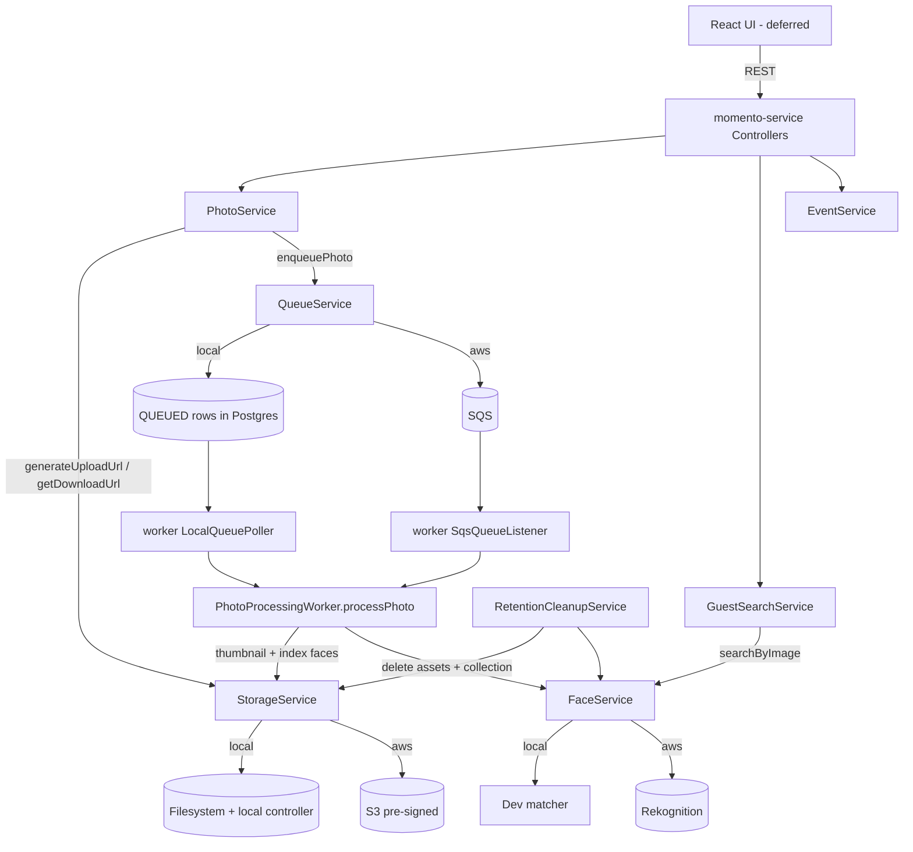

# Requirements

### Overview & Goals
The Momento platform already exists as a runnable skeleton (multi-module Spring Boot backend + worker, JWT auth, JPA entities, Flyway `V1` schema, React UI). This continuation focuses on **completing the REST endpoints that the bootstrap architecture specified but were never built**, so the admin and photographer management flows become functional end-to-end at the API level.

This milestone now also **implements the full AWS integration behind a Spring-profile switch**, replacing the current stubs (fake S3 URLs, no queueing, empty guest search, worker TODOs) with real behavior. Two interchangeable implementations are provided for every external dependency (storage, queue, face recognition):
- a **`local`** profile that runs with **no AWS and no Docker** (filesystem storage + a local upload/download endpoint, a DB-polling queue, and a dev-only face matcher), and
- an **`aws`** profile that uses **AWS SDK v2** (S3 pre-signed URLs, SQS, Rekognition).

**Module scope:** REST endpoints live in **`momento-service` only** (`momento-worker` has no controllers). The AWS/local abstractions and their implementations are added to **both** `momento-service` and `momento-worker`. The worker's photo-processing pipeline (queue consumption, face indexing, thumbnail generation) and retention cleanup are implemented as part of this milestone.

**UI scope:** `momento-ui` is intentionally **deferred** — it currently only defines routes and is left untouched here, to be wired to the completed API in a later dedicated step.

**Authentication:** all protected endpoints use **Bearer token auth** via the `Authorization: Bearer <jwt>` header — this is already the convention implemented by `JwtAuthenticationFilter`, and no changes to the auth scheme are needed.

### Scope
#### In Scope
- Proper `GET /api/auth/me` returning the authenticated user (currently returns literal `"Hello world"`).
- Event admin lifecycle endpoints: get-by-id, update, delete, `expire`, `process-all` (re-queue).
- Photographer assignment endpoints: assign, remove, list per event.
- Photo endpoints: list photos per event, processing-status summary.
- Move the existing stubbed `download-url` logic into the service layer behind a clean method (now backed by a real pre-signed/local URL).
- New request/response DTOs required by the above.
- All protected routes continue to use `Authorization: Bearer <jwt>` (already enforced by `JwtAuthenticationFilter`).
- **AWS abstractions:** `StorageService`, `QueueService`, `FaceService` interfaces in both `momento-service` and `momento-worker`, each with a `local` and an `aws` implementation selected by Spring profile.
- **Local profile:** filesystem-backed storage with a local upload/download controller, a DB-polling queue consumer in the worker, and a dev-only face matcher — runnable with no AWS/Docker.
- **AWS profile:** AWS SDK v2 clients (S3 pre-signed PUT/GET, SQS send/receive, Rekognition collection create / index faces / search-by-image), wired via config beans.
- **Photo flow wiring:** real pre-signed upload URLs, SQS/queue enqueue on `confirm-upload`, guest selfie search via face matching.
- **Worker pipeline:** `processPhoto` downloads the original, generates a thumbnail, indexes faces, and updates status; retention cleanup deletes S3 assets and the Rekognition collection.
- Adding the AWS SDK v2 BOM/dependencies to the `momento-service` and `momento-worker` `service` modules.

#### Out of Scope
- Re-architecting modules or changing the stack (module layout, DB schema, JWT auth remain as-is).
- Adding **new** REST controllers to `momento-worker` (it stays headless; only its processing/queue/cleanup logic changes).
- `momento-ui` changes — deferred to a later step.
- Production infrastructure provisioning (real S3 bucket / SQS queue / Rekognition collection creation in a cloud account, IAM, LocalStack/Docker setup).
- Automated tests — per user request, **no tests will be written** in this milestone.
- Advanced face-matching tuning (confidence thresholds beyond a sensible default) and thumbnail sizing beyond a single standard size.

### User Stories
- As an **admin**, I want to view, update, delete, expire, and reprocess an event so I can manage its full lifecycle.
- As an **admin**, I want to assign and remove photographers on an event and see who is assigned.
- As a **photographer/admin**, I want to list an event's photos and see a processing-status summary so I can monitor progress.
- As any **authenticated user**, I want `/api/auth/me` to return my real account so the UI can identify me.
- As a **photographer**, I want a real upload URL and my confirmed photo to be queued and processed so my photos become searchable.
- As a **guest**, I want to upload a selfie and receive the photos I appear in so I can download them.
- As a **developer**, I want to run the whole platform locally without AWS or Docker (via the `local` profile) and switch to real AWS (via the `aws` profile) without code changes.

### Functional Requirements
- `GET /api/auth/me` returns the current `UserResponse` derived from the security context; `401` when unauthenticated.
- `GET /api/event/{id}` returns the event by numeric id; `PUT /api/event/{id}` updates mutable fields; `DELETE /api/event/{id}` removes it.
- `POST /api/event/{eventId}/expire` transitions the event to `EXPIRED` and sets `expiresAt`; physical asset deletion is handled asynchronously by the worker's retention cleanup.
- `POST /api/event/{eventId}/process-all` re-queues all of the event's photos to `QUEUED`.
- `POST /api/event/{eventId}/photographers` assigns a photographer (idempotent); `DELETE /api/event/{eventId}/photographers/{photographerId}` removes the assignment; `GET /api/event/{eventId}/photographers` lists assignments.
- `GET /api/event/{eventId}/photos` returns the event's photos as `PhotoResponse`.
- `GET /api/event/{eventId}/processing-status` returns counts grouped by `PhotoStatus`.
- `GET /api/public/photos/{photoId}/download-url` returns a working download URL served through `StorageService` (pre-signed GET under `aws`, local endpoint URL under `local`).

**AWS / local integration:**
- The active integration is selected by Spring profile: `local` (default for dev) or `aws`; no code path is hard-coded to a provider.
- `POST /event/{eventId}/photos/upload-urls` returns a URL the client can `PUT` the file bytes to (pre-signed S3 PUT under `aws`; a local upload controller under `local`).
- `POST /photos/confirm-upload` sets the photo to `QUEUED` **and** enqueues its id for processing (SQS `SendMessage` under `aws`; DB-polling pickup under `local`).
- `POST /event/{slug}/search` performs real matching: the guest selfie is matched against the event's indexed faces and the matched `PhotoResponse` list is returned (Rekognition `SearchFacesByImage` under `aws`; dev matcher under `local`).
- Worker `processPhoto` downloads the original, generates and stores a thumbnail (`thumbnailS3Key`), indexes faces into the event's collection (persisting `RekognitionFace` rows), and marks the photo `PROCESSED` (or `FAILED`).
- Retention cleanup deletes the event's S3 originals/thumbnails and its Rekognition collection, and removes stale guest selfies.

### Non-Functional Requirements
- Follow the existing module layering (`api` -> `service` -> `data`) and current conventions (Lombok `@RequiredArgsConstructor`, `ResponseEntity`, `@Transactional` on writes).
- Preserve the existing `/api/event` (singular) path convention already used by controllers.
- Keep role-based access consistent with the existing `SecurityConfig`/`JwtAuthenticationFilter`.
- Use Bearer token authentication (`Authorization: Bearer <jwt>`), consistent with the existing `JwtAuthenticationFilter`.
- The `local` profile must run with **no external services** (no AWS credentials, no Docker) so the full flow is demonstrable on a dev machine.
- Provider selection is configuration-only (Spring profile + `aws.*` keys already present in `application.yml`); switching profiles requires no code changes.
- AWS SDK usage stays confined to the `aws`-profiled implementation classes; the rest of the code depends only on the `StorageService`/`QueueService`/`FaceService` interfaces.
- No automated tests are added in this milestone (per user request).

# Technical Design

### Current Implementation
Backend is a multi-module Gradle project (`api`, `service`, `data`, `application`) mirrored in `momento-service` and `momento-worker`.

**Existing endpoints today:**
- `AuthController`: `POST /api/auth/register`, `POST /api/auth/login`, `GET /api/auth/me` (stub returning `"Hello world"`).
- `EventController` (`/api/event`): `POST`, `GET` (all), `GET /{slug}`.
- `PhotoController` (`/api`): `POST /event/{eventId}/photos/upload-urls`, `POST /photos/confirm-upload`.
- `GuestController` (`/api/public`): `GET /event/{slug}`, `POST /event/{slug}/search`, `GET /photos/{photoId}/download-url` (stub returning `http://fake-download-url.com/{id}`).

**Supporting code already present:** `EventService`, `PhotoService`, `AuthService`, `JwtService`, DTOs (`EventResponse`, `PhotoResponse`, `UserResponse`, etc.), and repositories with useful finders: `PhotoRepository.findByEvent` / `findByEventAndProcessingStatus`, `EventPhotographerRepository.findByEvent` / `findByPhotographer`, `EventRepository.findBySlug`. Entities `EventPhotographer`, `Photo`, `Event`, `UserAccount`, `RekognitionCollection`, `RekognitionFace`, `GuestSearch` and enums `PhotoStatus`, `EventStatus`, `UserRole` exist.

**Current stub behavior (to be replaced):**
- `PhotoService.getUploadUrls` saves `Photo` rows and returns `http://fake-s3-url.com/...` URLs; `originalS3Key` is set to `events/{eventId}/originals/{photoId}.jpg`.
- `PhotoService.confirmUpload` only flips status to `QUEUED` — **nothing is enqueued**.
- `GuestSearchService.searchPhotos` records consent and returns an **empty** `matchedPhotos` list; `GuestSearchRequest` has no selfie field yet.
- `GuestController.getDownloadUrl` returns `http://fake-download-url.com/{id}`.
- Worker `PhotoProcessingWorker.processPhoto(Long)` exists but **has no caller** (no SQS listener / poller); face indexing and thumbnails are TODOs.
- `RetentionCleanupService` flips events to `EXPIRED` on a `@Scheduled` cron but S3/Rekognition deletion and temp-selfie cleanup are TODOs.

**Build & config facts:** Gradle Kotlin DSL, Java 21, Spring Boot BOM `3.3.4`; **AWS SDK is not yet on the classpath**. Both `application.yml` files already define `aws.region`, `aws.s3.bucket-name`, `aws.sqs.queue-url`, `aws.rekognition.collection-id-prefix`. No Spring profile is currently activated. `Photo` already has `originalS3Key` / `thumbnailS3Key`; `RekognitionFace` has `faceId` / `externalImageId` / `boundingBox` / `confidence`; `RekognitionCollection` has `awsCollectionId` / `status`.

### Key Decisions
1. **Abstraction + two profile-selected implementations** — define `StorageService`, `QueueService`, `FaceService` interfaces; provide a `@Profile("local")` implementation (filesystem + DB-poll + dev matcher) and a `@Profile("aws")` implementation (S3/SQS/Rekognition). Rationale: gives a zero-dependency local run path AND a real production path, switched purely by configuration.
2. **Interfaces duplicated per module** — `momento-service` and `momento-worker` are independent Gradle builds with separate packages (`com.momento` vs `com.momentoworker`), so each gets its own copy of the interfaces/impls (service side focuses on upload/download URLs + enqueue + selfie search; worker side on download/thumbnail/index + cleanup + consume). Rationale: no shared module exists and creating one is out of scope.
3. **Local queue = DB polling, not in-memory** — because service and worker are separate JVMs, the `local` queue impl relies on the shared DB: `confirmUpload`/`process-all` set photos to `QUEUED`, and the worker's `local` profile runs a `@Scheduled` poller that picks `QUEUED` photos and calls `processPhoto`. The `aws` profile uses SQS send + an `@SqsListener`/receive loop. Rationale: works cross-process locally with no broker.
4. **Local storage = filesystem + local HTTP endpoints** — `StorageService.generateUploadUrl` returns a URL to a new local upload controller (accepts `PUT` bytes into a configured directory); downloads are served by a local file controller. The `aws` impl returns real pre-signed S3 PUT/GET URLs. Rationale: keeps the client contract (`PUT` to a URL) identical across profiles.
5. **Local face matcher is dev-only** — with no ML available locally, the `local` `FaceService` returns a deterministic, documented result (e.g. all `PROCESSED` photos of the event) so the end-to-end flow is demonstrable; the `aws` impl uses Rekognition `IndexFaces` + `SearchFacesByImage`. Rationale: unblocks local testing without pretending to do real recognition.
6. **AWS SDK v2 via BOM** — add `software.amazon.awssdk:bom` and the `s3`, `sqs`, `rekognition` modules to the two `service` build files; SDK clients created as `@Profile("aws")` `@Bean`s in the `application` config. Rationale: matches the existing dependency-management/BOM style.
7. **Keep the `/api/event` singular convention, reuse DTOs/finders, Bearer auth unchanged** — new routes align to the existing singular path; reuse `PhotoResponse`/`UserResponse`/`EventResponse` and existing repository finders; `JwtAuthenticationFilter` Bearer flow is untouched.
8. **`process-all` re-queues via status flip + enqueue** — sets each photo to `QUEUED` and enqueues it through `QueueService`, mirroring `confirmUpload`. Rationale: consistent single enqueue path.
9. **No tests** — per user request, this milestone ships without automated tests. Rationale: explicit user constraint.

### Endpoint Inventory (missing -> to add)
 Method | Path | Handler | Notes |
---|---|---|---|
 GET | `/api/auth/me` | `AuthController.me` | Return real `UserResponse` from security context (replace stub) |
 GET | `/api/event/{id}` | `EventController` | Get by numeric id |
 PUT | `/api/event/{id}` | `EventController` | Update mutable fields |
 DELETE | `/api/event/{id}` | `EventController` | Delete event |
 POST | `/api/event/{eventId}/expire` | `EventController` | Status -> `EXPIRED` |
 POST | `/api/event/{eventId}/process-all` | `EventController`/`PhotoController` | Re-queue photos to `QUEUED` |
 POST | `/api/event/{eventId}/photographers` | `EventController` | Assign photographer |
 DELETE | `/api/event/{eventId}/photographers/{photographerId}` | `EventController` | Remove assignment |
 GET | `/api/event/{eventId}/photographers` | `EventController` | List assignments |
 GET | `/api/event/{eventId}/photos` | `PhotoController` | List `PhotoResponse` |
 GET | `/api/event/{eventId}/processing-status` | `PhotoController` | Counts by `PhotoStatus` |
 GET | `/api/public/photos/{photoId}/download-url` | `GuestController` | Move stub into service method |

### Proposed Changes

**Abstractions (both modules, new `.../service/integration` package):**
- `StorageService` — `generateUploadUrl(key, contentType)`, `getDownloadUrl(key)`, and (worker) `getBytes(key)`, `putBytes(key, bytes, contentType)`, `delete(key)` / `deletePrefix(prefix)`.
- `QueueService` — (service) `enqueuePhoto(photoId)`; (worker) message consumption entry point.
- `FaceService` — (service) `searchByImage(collectionId, selfieBytes)` -> matched external image ids/photo ids; (worker) `ensureCollection(event)`, `indexFace(collectionId, photo, bytes)`, and cleanup `deleteCollection(collectionId)`.
- Local impls: `LocalStorageService`, `LocalQueueService`, `LocalFaceService` (`@Profile("local")`). AWS impls: `S3StorageService`, `SqsQueueService`, `RekognitionFaceService` (`@Profile("aws")`).

**`momento-service` wiring:**
- `PhotoService.getUploadUrls` — use `StorageService.generateUploadUrl(originalS3Key, contentType)` instead of the fake URL.
- `PhotoService.confirmUpload` — after setting `QUEUED`, call `QueueService.enqueuePhoto(photoId)`.
- `PhotoService.getDownloadUrl(photoId)` — resolve the photo and return `StorageService.getDownloadUrl(originalS3Key)`.
- `GuestSearchService.searchPhotos` — add a selfie to `GuestSearchRequest` (base64 or multipart), call `FaceService.searchByImage(...)`, resolve matched `Photo`s and populate `matchedPhotos`.
- New endpoints: `EventService` gains `getEventById/updateEvent/deleteEvent/expireEvent` + `assignPhotographer/removePhotographer/listPhotographers`; `PhotoService` gains `listPhotos/getProcessingStatus/reprocessAll` (reprocess also enqueues); controllers `AuthController.me`, and new routes on `EventController`/`PhotoController`/`GuestController`.
- Local upload/download controller (e.g. `LocalStorageController`, `@Profile("local")`) serving `PUT`/`GET` of file bytes under a configured directory.

**`momento-worker` wiring:**
- `PhotoProcessingWorker.processPhoto` — `StorageService.getBytes(originalS3Key)` -> generate thumbnail (Java `ImageIO`/Thumbnailator-style) -> `putBytes(thumbnailS3Key)` -> `FaceService.ensureCollection` + `indexFace` (persist `RekognitionFace`) -> set `PROCESSED`/`FAILED`.
- Queue consumption: `local` -> a `@Scheduled` DB poller for `QUEUED` photos; `aws` -> an SQS receive loop / `@SqsListener` that calls `processPhoto`.
- `RetentionCleanupService` — fill the TODOs: `StorageService.deletePrefix(events/{id}/...)` and `FaceService.deleteCollection(...)` for expired events; delete stale guest selfies.

**DTOs (new):** `AssignPhotographerRequest` (in), `PhotographerResponse` (out), `ProcessingStatusResponse` (out); extend `GuestSearchRequest` with a `selfie` field. Reuse `PhotoResponse`, `UserResponse`, `EventResponse`.

**Config & security:** AWS SDK client `@Bean`s (`S3Client`/`S3Presigner`, `SqsClient`, `RekognitionClient`) as `@Profile("aws")` beans in each `application` config; add storage-directory config keys for `local`; ensure new admin routes are guarded in `SecurityConfig`; `/me` resolves the principal via `UserRepository.findByEmail(authentication.getName())`.

### Data Models / Contracts
- No schema changes — `event_photographers`, `photos`, `events`, `rekognition_collections`, `rekognition_faces`, `guest_searches` tables/entities already exist (Flyway `V1__Initial_Schema.sql`); `Photo.thumbnailS3Key` and the Rekognition tables are already present and simply become populated.
- `ProcessingStatusResponse` example: `{ "UPLOADED": 2, "QUEUED": 5, "PROCESSING": 1, "PROCESSED": 40, "FAILED": 0 }`.
- `AssignPhotographerRequest`: `{ "photographerId": <Long> }`.
- Interface sketches:
```java
interface StorageService {
    String generateUploadUrl(String key, String contentType);
    String getDownloadUrl(String key);
}
interface QueueService { void enqueuePhoto(Long photoId); }
interface FaceService { List<String> searchByImage(String collectionId, byte[] selfie); }
```
- `GuestSearchRequest` gains `String selfie` (base64) alongside the existing consent fields.
- Config keys: reuse `aws.region` / `aws.s3.bucket-name` / `aws.sqs.queue-url` / `aws.rekognition.collection-id-prefix`; add `storage.local.dir` for the `local` profile; activate via `spring.profiles.active=local|aws`.

### File Structure
**momento-service:**
- `api/.../controller/` — extend `AuthController`, `EventController`, `PhotoController`, `GuestController`; add `LocalStorageController` (`@Profile("local")`).
- `service/.../service/` — extend `EventService`, `PhotoService`, `GuestSearchService`.
- `service/.../service/integration/` — add `StorageService`, `QueueService`, `FaceService` + `Local*`/`S3*`/`Sqs*`/`Rekognition*` impls.
- `service/.../service/dto/in/` — add `AssignPhotographerRequest`; extend `GuestSearchRequest`.
- `service/.../service/dto/out/` — add `PhotographerResponse`, `ProcessingStatusResponse`.
- `service/build.gradle.kts` — add AWS SDK v2 (`s3`, `sqs`, `rekognition`) + BOM.
- `application/.../config/` — `SecurityConfig` route rules; new `AwsConfig` (`@Profile("aws")` client beans); `application.yml` profile/`storage.local.dir` keys.

**momento-worker:**
- `service/.../service/integration/` — add `StorageService`, `QueueService`, `FaceService` + `Local*`/`S3*`/`Sqs*`/`Rekognition*` impls.
- `service/.../service/` — flesh out `PhotoProcessingWorker` and `RetentionCleanupService`; add `LocalQueuePoller` (`@Profile("local")`, `@Scheduled`) and `SqsQueueListener` (`@Profile("aws")`).
- `service/build.gradle.kts` — add AWS SDK v2 modules + an image/thumbnail library.
- `application/.../` — `AwsConfig` client beans; `application.yml` profile keys.

**momento-ui:** unchanged in this milestone (deferred).

### Architecture Diagram


### Risks
- **Interface duplication drift** between `momento-service` and `momento-worker` (no shared module): mitigated by keeping the interfaces small and symmetric and documenting them in one place here.
- **Local queue latency**: DB polling adds a small delay vs SQS push; acceptable for dev. Poll interval is configurable.
- **Local face matcher is not real recognition**: it returns a deterministic dev result; clearly documented so it is not mistaken for production behavior.
- **AWS SDK footprint / credentials**: `aws` profile requires valid credentials and a reachable bucket/queue/collection; failures must degrade to `FAILED` photo status rather than crashing the worker.
- **Role enforcement gaps**: new admin endpoints must be guarded in `SecurityConfig`.
- **Selfie handling & privacy**: guest selfies are transient; retention cleanup must remove them, and consent is still enforced before search.

# Delivery Steps

### ✓ Step 1: Integration abstractions, profiles, and AWS SDK scaffolding
Both backend modules build with AWS SDK v2 available and define provider-agnostic integration interfaces selected by Spring profile.

- Add AWS SDK v2 BOM + `s3`, `sqs`, `rekognition` (and an image/thumbnail library in the worker) to `momento-service/service/build.gradle.kts` and `momento-worker/service/build.gradle.kts`, matching the existing BOM/dependency-management style.
- Create the `.../service/integration` package in each module with the `StorageService`, `QueueService`, and `FaceService` interfaces (service-side and worker-side method sets as described in Proposed Changes).
- Add `spring.profiles.active` handling and a `storage.local.dir` key to both `application.yml` files; document `local` (default) and `aws`.
- Add an `AwsConfig` in each `application` module declaring `@Profile("aws")` client beans (`S3Client`/`S3Presigner`, `SqsClient`, `RekognitionClient`) wired from the existing `aws.*` config keys.

### ✓ Step 2: Local-profile implementations (no AWS/Docker)
The whole platform runs end to end on the `local` profile using the filesystem and the database only.

- Implement `LocalStorageService` (filesystem under `storage.local.dir`) returning URLs to a new `LocalStorageController` (`@Profile("local")`) that accepts `PUT` bytes and serves `GET` downloads in `momento-service`.
- Implement `LocalQueueService` in `momento-service` (enqueue = ensure photo is `QUEUED`) and a `LocalQueuePoller` (`@Profile("local")`, `@Scheduled`) in `momento-worker` that picks up `QUEUED` photos and calls `processPhoto`.
- Implement the worker `LocalStorageService` (filesystem read/write/delete) and a dev-only `LocalFaceService` (deterministic match, e.g. all `PROCESSED` photos of the event) in both modules.

### ✓ Step 3: AWS-profile implementations (S3 / SQS / Rekognition)
The same interfaces are backed by real AWS services under the `aws` profile.

- Implement `S3StorageService` (pre-signed PUT/GET via `S3Presigner`; `getBytes`/`putBytes`/`deletePrefix` via `S3Client` in the worker).
- Implement `SqsQueueService` (send message) in `momento-service` and an `SqsQueueListener` (`@Profile("aws")` receive loop) in `momento-worker` that calls `processPhoto`.
- Implement `RekognitionFaceService` (`ensureCollection`, `indexFace`, `searchByImage`, `deleteCollection`) persisting `RekognitionCollection`/`RekognitionFace` rows.

### ✓ Step 4: Wire the momento-service photo & guest-search flow to the abstractions
Photo operations and guest selfie searches use real storage, queue, and face recognition services.

- Update `PhotoService.getUploadUrls` to use `StorageService.generateUploadUrl` and `confirmUpload` to also call `QueueService.enqueuePhoto`.
- Add `PhotoService.getDownloadUrl(photoId)` backed by `StorageService.getDownloadUrl` and route `GET /api/public/photos/{photoId}/download-url` through it.
- Extend `GuestSearchRequest` with a `selfie` field and update `GuestSearchService.searchPhotos` to call `FaceService.searchByImage`, resolve matched `Photo`s, and populate `matchedPhotos` (consent still enforced).

### ✓ Step 5: Implement the momento-worker processing pipeline and retention cleanup
The background worker now processes photo uploads and cleans up expired events.

- Flesh out `PhotoProcessingWorker.processPhoto`: download original via `StorageService`, generate + store a thumbnail (`thumbnailS3Key`), `ensureCollection` + `indexFace`, set `PROCESSED` (or `FAILED` on error without crashing the worker).
- Ensure consumption is wired for both profiles (local poller / SQS listener from Steps 2–3).
- Complete `RetentionCleanupService` TODOs: delete the event's S3 originals/thumbnails via `StorageService.deletePrefix`, delete its Rekognition collection via `FaceService.deleteCollection`, and remove stale guest selfies.

### ✓ Step 6: Complete the missing REST endpoints (auth, event lifecycle, photographers, photos)
All specified admin and photographer management endpoints are now functional.

- Replace `AuthController.me` with a real handler returning the authenticated `UserResponse` (resolve via `UserRepository.findByEmail(authentication.getName())`).
- Add `EventService.getEventById/updateEvent/deleteEvent/expireEvent` and routes `GET/PUT/DELETE /api/event/{id}` + `POST /api/event/{eventId}/expire`.
- Add `AssignPhotographerRequest`/`PhotographerResponse` and `EventService.assignPhotographer/removePhotographer/listPhotographers` with routes under `/api/event/{eventId}/photographers` (validate photographer role, idempotent assign).
- Add `PhotoService.listPhotos/getProcessingStatus/reprocessAll` (+ `ProcessingStatusResponse`) and routes `GET /api/event/{eventId}/photos`, `GET /api/event/{eventId}/processing-status`, `POST /api/event/{eventId}/process-all` (reprocess enqueues via `QueueService`).
- Guard all new admin routes in `SecurityConfig`.